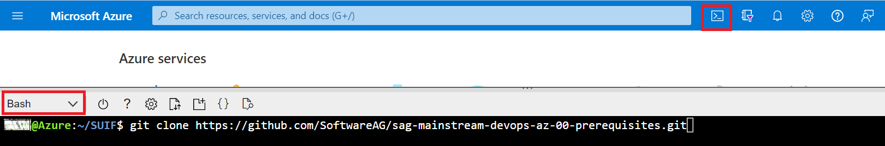

# Software AG Mainstream DevOps for Integration - Azure DevOps Tutorial Prerequisites

- [Software AG Mainstream DevOps for Integration - Azure DevOps Tutorial Prerequisites](#software-ag-mainstream-devops-for-integration---azure-devops-tutorial-prerequisites)
  - [Azure Resources](#azure-resources)
    - [Quick Start with Cloud Shell](#quick-start-with-cloud-shell)
      - [Prerequisites](#prerequisites)
      - [Operations](#operations)
        - [Option 1: Bash cloud shell with mount of the cloud share](#option-1-bash-cloud-shell-with-mount-of-the-cloud-share)
        - [Option 2: Bash cloud shell without mounting the cloud share](#option-2-bash-cloud-shell-without-mounting-the-cloud-share)
      - [Other Options](#other-options)
  - [Secure files](#secure-files)

This repository provides a set of convenient scripts that you can use to prepare Azure Cloud compute resorces to support the mainstream DevOps pipelines used in the `sag-mainstream-devops-az-*` repositories.

## Azure Resources

### Quick Start with Cloud Shell

#### Prerequisites

- A valid Azure user
- A valid Azure service principal, identified with a secret
- A Resource Group where you are owner
  - If you have access to a subscription where you are owner you can create the resource group and assign the relevant permissions to the resource group
  - If you only have access to the resource group, ask the subscription owner to assign the contributor role to the service principal on the resource group
- Browser access to Azure resources via [Azure Portal](https://portal.azure.com)
- Clone this repository on your PC

#### Operations

##### Option 1: Bash cloud shell with mount of the cloud share

- Open a browser to [Azure Portal](https://portal.azure.com)
- Open a cloud shell with "bash"
  - If this is the first time you open a cloud shell associate a storage account and a share to it
    - You may create the storage account inside the given resource group if you do not have other options
- Follow the instructions in Azure on how to mount the share on your local pc
  - Example: [how to mount the share on Windows](https://docs.microsoft.com/en-us/azure/storage/files/storage-how-to-use-files-windows)
  - Example: [how to mount the share on Linux](https://docs.microsoft.com/en-us/azure/storage/files/storage-how-to-use-files-linux?tabs=smb311)
- Copy the folder "bash" of this repository onto the share in a convenient location (e.g. `z:\az-pipe-prerequisites\bash`)
- Inside the above folder copy `setEnvExample.sh` into `setEnv.sh`
- Edit `setEnv.sh` and set the values of your enviornment
  - If you do not know the App ID of your service principal, use the following command to obtain it
    - `az ad sp list --display-name "DevOps - TrainingSP - 9" -o table`
- Execute the shell scripts in the given order (00 to 11) or use directly the more convenient `createAll.sh`
- Eventually execute `98.produceEnvForDev.sh`. Copy the three "export" resulting lines into a private file on your PC. These lines will be saved in a secure file in the DevOps project.

##### Option 2: Bash cloud shell without mounting the cloud share

- Open a browser to [Azure Portal](https://portal.azure.com/)
- Open a cloud shell with "bash".
- Clone this repository into a folder of your choice.

    

    ```bash
    cd clouddrive
    git clone -b main --single-branch https://github.com/SoftwareAG/sag-mainstream-devops-az-00-prerequisites.git
    cd sag-mainstream-devops-az-00-prerequisites
    ```

- Navigate to folder "bash" and copy the file ```setEnvExample.sh``` into ```setEnv.sh```

    ```bash
    cd bash
    cp setEnvExample.sh setEnv.sh
    ```

- Edit ```setEnv.sh``` and set the values as per your environment

    ```bash
    vi setEnv.sh
    ```
    **Note:** Watch the naming constraints, e.g. SA names must be max 24 chars long and lowercase. Keep the MY_PREFIX short, lowercase and without spceial characters. Eventually shorten the names that concatenate it.

- Execute the shell scripts in the given order (00 to 11) or use directly the more convenient ```createAll.sh```. Verify the file permissions before executing it.
- Eventually execute ```98.produceEnvForDev.sh```. Copy the three "export" resulting lines into a private file on your PC. These lines will be saved in a secure file in the DevOps project.

```NOTE: Azure Cloud Shell comes with folder "clouddrive" by default. After executing "00.assureLocalSshKeys.sh" verify link is created for folder "clouddrive/.ssh"```  


#### Other Options

**TODO**: other options are easily available, they will be documented if necessary

## Secure files

In the `secureFiles` subfolder you will find examples of the files that will be required to be uploaded into the Azure DevOps project.

- Copy every `example.*.sh` into `*.sh` (i.e. remove the "Example." prefix from the name)
- Edit the files and declare your own environment specific keys.
- Upload the files in the Piepelines->Library->Secure files section maintaining the names. These names are refered to in the provided azure-pipeline.yml files.
- When the time comes, i.e. when you will have the actual pipelines, grant the permissions as follows:
  - `sdc.credentials.sh` is used to access Software AG Empower Download Center (aka "SDC") and is only used in the first pipeline
  - `sa.share.secrets.sh` is used to access the storage account where the product and fixes zip files are stored and is in the first two pipelines
    - the contents of this file may be obtained from cloud shell with the script `98.produceEnvForDev.sh`
  - `acr.sp.credentials.sh` is used to access the Azure Container Registry (ACR) in all pipelines besides the first one
- specific license files will also be uploaded as secure files, but they will depend on the contents of the pipelines. `msr-license.xml` will likely be always used

______________________
These tools are provided as-is and without warranty or support. They do not constitute part of the Software AG product suite. Users are free to use, fork and modify them, subject to the license agreement. While Software AG welcomes contributions, we cannot guarantee to include every contribution in the master project.
